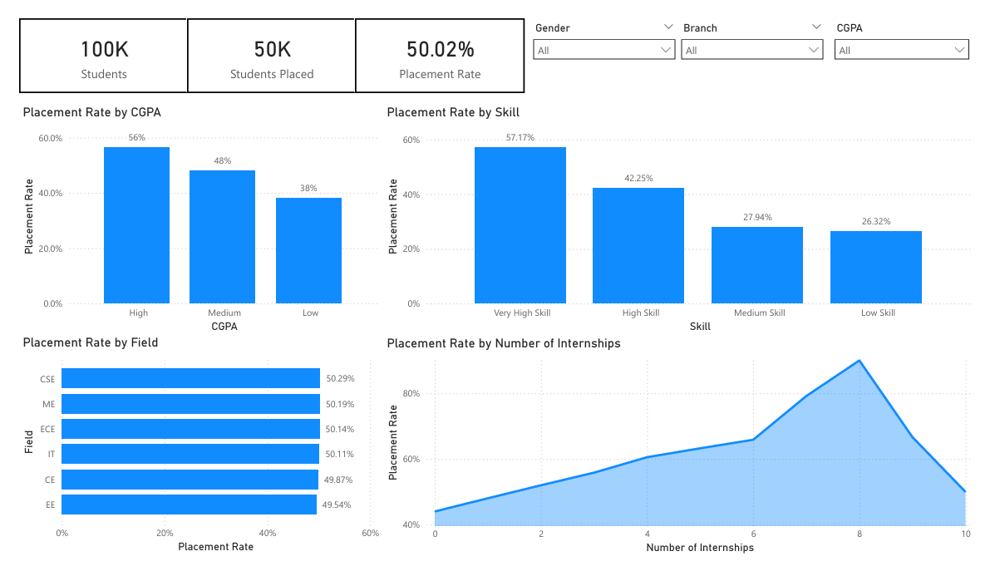

<a id="readme-top"></a>


<!-- BADGES -->
<p align="center">
  <a href="https://www.linkedin.com/in/john-lecegues/">
    
  </a>
  
  
  
</p>


<!-- TITLE -->
<br />
<div align="center">
  <a href="https://github.com/github_username/repo_name">
    
  </a>

  <h3 align="center">Student Placement Analysis</h3>

  <p align="center">
    Small data analytics project exploring factors that influence student placement outcomes.
    <br />
    Built using Python, SQL, and Power BI.
    <br />
    <br />
  </p>
</div>

<!-- ABOUT THE PROJECT -->
## About The Project

This project analyzes a student placement dataset to understand what factors are associated with higher placement rates.
A small project to refresh my skills and analyze at a high-level a student placement dataset to understand what factors are associated with higher placement rates.

## Dataset
- Source: [Kaggle: Student Placement Prediction Dataset](https://www.kaggle.com/datasets/sharmajicoder/student-placement-prediction)
- Original Size: 1,000,000 rows
- Used: 100,000 row sample for performance

## Key Insights
- Higher CGPA → higher placement rate
- Internships have strong impact on placement outcomes
- Branch has minimal effect on placement

<!-- GETTING STARTED -->
## Getting Started & Usage

### Prerequisites
- Python 3
- Power BI Desktop

### Run the Project
1. Clone the repository
```bash
git clone https://github.com/lecegues/student-placement-analytics.git
```
2. Install dependencies
```bash
pip install -r requirements.txt
```
3. Open PowerBI and load:
```bash
data/processed/student_placement_cleaned.csv
```

<p align="left">(<a href="#readme-top">back to top</a>)</p>
